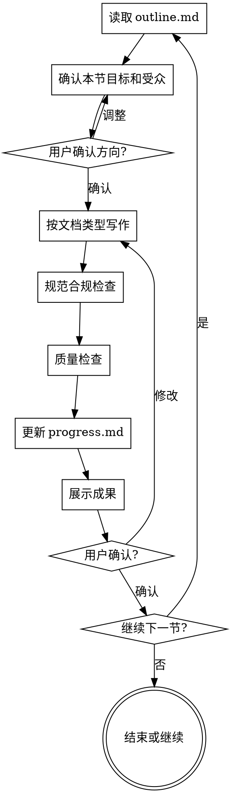

# 项目文档写作规范

负责工程/软件项目文档和通用项目报告的实际写作。与论文写作不同，项目文档允许更多结构化表达（列表、表格、编号需求），但仍须避免冗余和AI化表达。

<HARD-GATE>
调用此技能前必须满足以下条件：
1. plan/project-overview.md 存在且包含文档类型和章节结构
2. plan/outline.md 存在且已确认
3. chapters/ 目录已创建

如果任何条件不满足，必须先调用 brainstorming-research 技能。
</HARD-GATE>

## Checklist（每章/节必须完成）

- [ ] 读取 plan/outline.md 确认本节目标和内容范围
- [ ] 与用户确认本节关键内容和受众
- [ ] 按文档类型规范写作，输出到 chapters/XX-name.md
- [ ] **规范合规检查**：结构完整、术语一致、格式规范
- [ ] **质量检查**：无冗余、无歧义、表达清晰
- [ ] 更新 plan/progress.md
- [ ] 展示写作成果，询问用户确认或修改

---

## 一、文档类型写作规范

### 1.1 软件需求规格说明书（SRS）

- 需求使用"系统应（shall）"句式，明确、可验证
- 每条需求独立编号（如 FR-001、NFR-001）
- 功能需求与非功能需求分开
- 用例/用户故事配合需求说明
- 允许使用编号列表和表格

**质量标准（SMART需求）**：

| 维度 | 检查项 |
|------|--------|
| 具体（Specific） | 需求是否明确描述了"做什么" |
| 可测量（Measurable） | 是否有可量化的验收标准 |
| 可实现（Achievable） | 技术上是否可行 |
| 相关（Relevant） | 是否与项目目标对齐 |
| 有时限（Time-bound） | 是否说明了时间或版本范围 |

### 1.2 技术设计文档（概要/详细设计）

- 架构描述优先文字说明，辅以图表
- 模块划分需说明职责和接口
- 数据流/控制流需配合图表（可调用 figures-diagram 技能）
- 接口定义需包含参数、返回值、错误码
- 设计决策需说明备选方案和选择理由

### 1.3 项目可行性分析报告

- 结论先行：先给总体结论，再展开分析
- 量化分析优先：成本、工期、技术风险用数据说明
- SWOT 或风险矩阵辅助分析
- 建议部分需明确可操作的行动项

### 1.4 项目结题/总结报告

- 按计划与实际对比呈现（目标 vs 达成）
- 问题与解决方案需具体，不能泛泛而谈
- 经验教训聚焦可复用的做法，避免空洞总结
- 附件清单（代码、文档、数据）需完整

### 1.5 项目进展报告

- 结构紧凑：本期完成、下期计划、风险/障碍
- 进度数据客观：用百分比或任务完成数，不用"基本完成"
- 风险需说明严重程度和应对措施
- 读者导向：为决策者服务，关键信息前置

### 1.6 系统架构文档

- 分层描述：业务视图 → 逻辑视图 → 物理视图
- 每层配架构图（可调用 figures-diagram 技能）
- 技术选型需说明理由和对比
- 扩展性、可维护性、安全性需单独说明

### 1.7 测试报告

- 测试范围和目标明确
- 测试用例统计：总数、通过、失败、阻塞
- 缺陷按严重程度分类
- 结论需说明是否达到发布标准
- 遗留问题需标注影响和处理计划

---

## 二、写作语言规范

### 2.1 允许使用的结构

与论文写作不同，项目文档**允许**使用：

- 编号列表（需求条目、操作步骤、检查清单）
- 表格（对比分析、接口定义、风险矩阵）
- 粗体标注关键术语或重要警告
- 小标题层级（建议不超过3级）

### 2.2 禁用表达

| 类型 | 禁用词/句 |
|------|-----------|
| 空洞过渡词 | 首先、其次、最后（列表已有序号时）|
| 模糊量词 | 较大、较多、一定程度上、基本上 |
| 被动推卸 | 应该会、可能需要、大概是 |
| 空洞修饰 | 非常重要、极其关键（无数据时）|

### 2.3 推荐表达

- 用数据替代形容词："响应时间 < 200ms"而非"响应速度较快"
- 用主动句式："系统记录操作日志"而非"操作日志被系统记录"
- 受众导向：技术文档面向开发者，管理报告面向决策者
- 结论前置：重要结论放段首，不要让读者从中间找

---

## 三、两阶段 Review 机制

每节写作完成后，执行两阶段检查：

### 阶段1：规范合规检查

| 检查项 | 说明 |
|--------|------|
| 结构完整 | 章节结构是否符合该文档类型的标准 |
| 术语一致 | 关键术语是否在全文统一命名 |
| 需求可验证 | 每条需求/目标是否可测试或可度量 |
| 格式规范 | 编号、层级、表格格式是否统一 |

**检查结果**：✅ 通过 / ❌ 需修改

### 阶段2：质量检查

| 检查项 | 说明 |
|--------|------|
| 无歧义 | 每句话是否只有一种解读方式 |
| 无冗余 | 是否有重复表达或不必要的套话 |
| 受众适配 | 语言难度和专业程度是否匹配目标读者 |
| 可操作性 | 建议和行动项是否足够具体 |

**检查结果**：✅ 通过 / ❌ 需修改

---

## 四、写作流程

---

## 五、特殊章节指导

### 执行摘要（Executive Summary）

- 面向决策者，不面向技术人员
- 200-500字，涵盖背景、结论、建议
- 不含技术细节，只含决策所需信息

### 需求章节

- 功能需求按用户故事或用例组织
- 非功能需求分类：性能、安全、可用性、可维护性
- 约束条件（技术栈、合规、预算）单独列出
- 每条需求必须有唯一编号

### 架构/设计章节

- 先给出总体架构图，再分层展开
- 每个设计决策记录：问题 → 备选方案 → 选择 → 理由
- 接口定义用表格或代码块

### 风险章节

| 风险 | 概率 | 影响 | 应对措施 |
|------|------|------|----------|
| [风险描述] | 高/中/低 | 高/中/低 | [具体措施] |

### 结论与建议

- 结论对应目标，逐一说明是否达成
- 建议具体、可执行，明确责任人和时间节点

---

## 六、错误处理

### 如果 plan/ 不存在

> "检测到项目结构未创建。需要先完成头脑风暴确认文档类型和结构，才能开始写作。
>
> 是否现在开始头脑风暴？"

调用 brainstorming-research。

---

## 七、关键原则

- **受众优先** — 始终明确文档的读者是谁，语言和详细程度为其服务
- **可验证** — 每条需求/目标都可以被测试或度量
- **结论前置** — 重要结论放段首或节首，方便快速浏览
- **一节一写** — 完成并确认后再开始下一节
- **进度必须更新** — 每次写作后更新 progress.md
